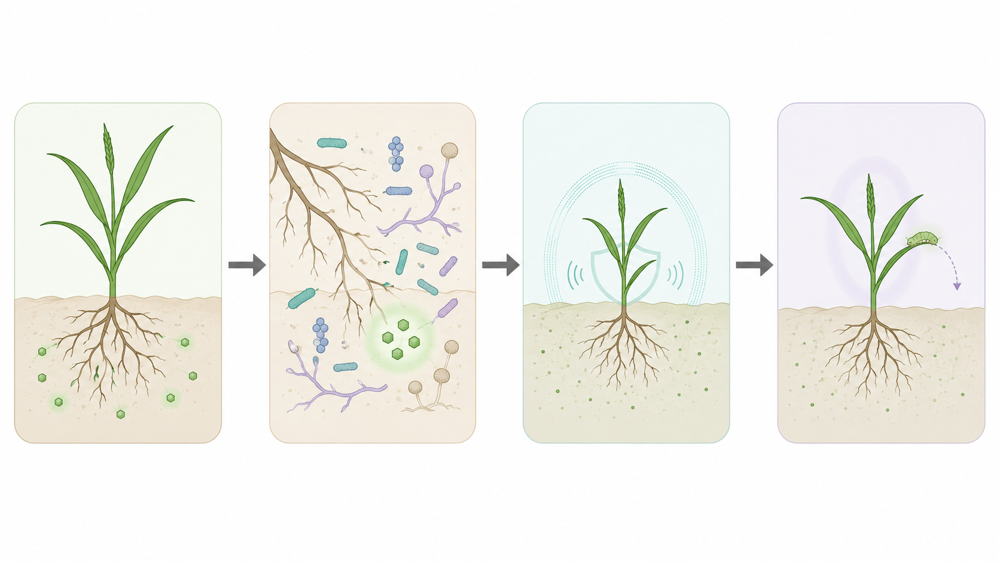

# gptgentool

这个仓库里目前放了两个 Chrome 工具：

1. `prompt_gen/`：论文图像 prompt 生成工具，用公开论文 API 批量检索论文摘要，并导出适合给 ChatGPT / 图像模型使用的学术示意图 prompt。
2. `chatgpt-automation-user-guide/`：ChatGPT 自动化批量执行工具的使用说明和本地改版扩展。这个工具是在别人发布的 ChatGPT Automation 基础上修改的，主要用于把 prompt 批量提交到 ChatGPT，并自动下载生成结果。

## 工具 1：Gentool Paper Prompt Crawler

目录：`prompt_gen/`

Gentool 是一个本地 Chrome 插件，用来批量生成论文配图 prompt。它会从 OpenAlex 和 Europe PMC 检索公开论文元数据 / 摘要，然后按领域整理成 `.txt` prompt 文件。

主要用途：

- 按生命科学、信息技术、材料能源、环境生态等领域批量检索论文。
- 自动整理论文摘要，生成适合图像模型的学术示意图 prompt。
- 支持“单图风格（偏流程图）”和“独立多屏风格”两类 prompt。
- 每个领域单独导出 txt 文件，便于后续批量喂给 ChatGPT 自动生成图片。
- 可以在生成后批量编辑某个领域 prompt 的前缀。

安装方式：

1. 打开 Chrome。
2. 进入 `chrome://extensions/`。
3. 打开“开发者模式”。
4. 点击“加载已解压的扩展程序”。
5. 选择 `prompt_gen/` 目录。

更详细的功能和字段说明见：`prompt_gen/README.md`。

## 工具 2：ChatGPT Automation 本地改版

目录：`chatgpt-automation-user-guide/`

这个工具用于在 `chatgpt.com` 上批量执行 prompt，并自动下载生成结果。本仓库里的版本不是原作者原版，而是在原工具基础上做的本地改版，主要配合 `prompt_gen/` 输出的 prompt 文件使用。

原工具信息：

- 原工具名称：ChatGPT Automation - Auto ChatGPT on chatgpt.com
- 原作者：Truong Nguyen
- 原网址：[Chrome Web Store - ChatGPT Automation](https://chromewebstore.google.com/detail/chatgpt-automation-auto-c/nocgcjgldlpeffhdhfjejhcgjbgcmpgb)
- 原作者网站：[kylenguyen.me](https://kylenguyen.me)

本地改版目录：

```text
chatgpt-automation-user-guide/
  modified-extension/
    chatgpt-automation-timeout-extended/
```

本地改版主要调整：

- 延长了部分等待 / 超时逻辑，更适合长时间批量生成。
- 增加对“独立多屏”prompt 的识别，遇到逐屏生成结果时会尽量下载同一回答里的多张图片。
- 自动下载图片时，会尝试从 `论文内容：` / `Paper content` 后面的论文文本提取短主题，用于文件命名。

使用方式：

1. 打开 Chrome 的 `chrome://extensions/`。
2. 打开“开发者模式”。
3. 点击“加载已解压的扩展程序”。
4. 选择 `chatgpt-automation-user-guide/modified-extension/chatgpt-automation-timeout-extended/`。
5. 打开 [chatgpt.com](https://chatgpt.com)，再打开该扩展的侧边栏。
6. 上传或粘贴 `prompt_gen/` 生成的 prompt txt 文件，设置并发、延迟和下载目录后运行。

更详细的使用说明见：

- 中文：`chatgpt-automation-user-guide/README_zh.md`
- English：`chatgpt-automation-user-guide/README.md`

## 推荐工作流

1. 用 `prompt_gen/` 按领域生成论文图像 prompt。
2. 检查并适当修改导出的 txt 文件。
3. 在 ChatGPT Automation 本地改版中批量导入 prompt。
4. 使用 ChatGPT 的图像生成能力批量生成图片。
5. 自动下载图片，并按论文主题整理文件名。

## 效果示例

下面是两类 prompt 的效果示例。

示例图片统一放在：

```text
doc/example/
```

## 单图风格示例

### 图 1：信息技术与智能科技


对应 prompt：

```text
Create image with aspect ratio: 16:9: 请根据以下论文内容生成一张极简无文字信息技术与智能科技学术示意图，风格偏扁平矢量学术插画，参考干净医学插画的简洁度，允许少量柔和阴影和轻微体积感。只表达核心机制，不画完整复杂场景；画面最多包含3到5个主要图形单元、1到3条主箭头、2到4个浅色圆角分区或模块。使用大面积留白、低饱和配色、清晰轮廓和简单形状；不要标题、标签、字母、数字或说明文字。避免密集纹理、密集碎线、颗粒堆叠、重复图标或节点、复杂微小结构、强高光、照片级3D渲染和过多小元素；整体更简洁，更接近干净的论文机制流程示意图。可优先考虑这些视觉对象：机器人、芯片、神经网络、智能设备、数据节点、云端、传感器、人机交互界面元素。论文内容：Deep Convolutional and LSTM Recurrent Neural Networks for Multimodal Wearable Activity Recognition. Human activity recognition (HAR) tasks have traditionally been solved using engineered features obtained by heuristic processes. Current research suggests that deep convolutional neural networks are suited to automate feature extraction from raw sensor inputs. However, human activities are made of complex sequences of motor movements, and capturing this temporal dynamics is fundamental for successful HAR. Based on the recent success of recurrent neural networks for time series domains, we propose a generic deep framework for activity recognition based on convolutional and LSTM recurrent units, which: (i) is suitable for multimodal wearable sensors; (ii) can perform sensor fusion naturally; (iii) does not require expert knowledge in designing features; and (iv) explicitly models the temporal dynamics of feature activations. We evaluate our framework on two datasets, one of which has been used in a public activity recognition challenge. Our results show that our framework outperforms competing deep non-recurrent networks on the challenge dataset by 4% on average; outperforming some of the previous reported results by up to 9%.
```

### 图 2：生物医学与生命科学



对应 prompt：

```text
Create image with aspect ratio: 16:9: 请根据以下论文内容生成一张极简无文字生物医学与生命科学学术示意图，风格偏扁平矢量学术插画，参考干净医学插画的简洁度，允许少量柔和阴影和轻微体积感。只表达核心机制，不画完整复杂场景；画面最多包含3到5个主要图形单元、1到3条主箭头、2到4个浅色圆角分区或模块。使用大面积留白、低饱和配色、清晰轮廓和简单形状；不要标题、标签、字母、数字或说明文字。避免密集纹理、密集碎线、颗粒堆叠、重复图标或节点、复杂微小结构、强高光、照片级3D渲染和过多小元素；整体更简洁，更接近干净的论文机制流程示意图。可优先考虑这些视觉对象：细胞、组织、器官、微生物、DNA、RNA、蛋白质、药物分子、实验器材、免疫细胞、疾病相关结构。论文内容：Root exudate metabolites drive plant-soil feedbacks on growth and defense by shaping the rhizosphere microbiota. By changing soil properties, plants can modify their growth environment. Although the soil microbiota is known to play a key role in the resulting plant-soil feedbacks, the proximal mechanisms underlying this phenomenon remain unknown. We found that benzoxazinoids, a class of defensive secondary metabolites that are released by roots of cereals such as wheat and maize, alter root-associated fungal and bacterial communities, decrease plant growth, increase jasmonate signaling and plant defenses, and suppress herbivore performance in the next plant generation. Complementation experiments demonstrate that the benzoxazinoid breakdown product 6-methoxy-benzoxazolin-2-one (MBOA), which accumulates in the soil during the conditioning phase, is both sufficient and necessary to trigger the observed phenotypic changes. Sterilization, fungal and bacterial profiling and complementation experiments reveal that MBOA acts indirectly by altering root-associated microbiota. Our results reveal a mechanism by which plants determine the composition of rhizosphere microbiota, plant performance and plant-herbivore interactions of the next generation.
```

## 独立多屏风格示例

这个模式用于让 ChatGPT 按屏幕逐张生成图片，避免把多个结果拼成一张图。


对应 prompt：

```text
Create image with aspect ratio: 16:9: 请根据以下论文内容生成图片。关键执行方式：从第1屏开始重新生成单张独立图，逐屏执行：第1屏、第2屏、第3屏、第4屏，生成完一张自动继续下一张，直到第4屏完成。每一屏都是一张单独图片、单独画布、单独结果；不要四宫格，不要拼图，不要拼版，不要长图，不要把多个结果合成在同一张画布或同一个外框里。主题领域：城市建筑与交通物流。第1屏到第3屏分别使用1:1比例：从论文内容中挑选3个最有代表性、最适合单独成图的物品、主体或场景元素，各生成一张简单卡通素材图；每屏只画1个核心对象，可加入少量辅助小元素，但不要表达步骤、因果或流程。这些屏幕必须是简单物件素材图，白色或浅色纯背景，主体居中或轻微偏移，轮廓清楚，少细节、少纹理，像可单独使用的图标/贴纸/素材；不要画完整场景、微缩生态景观、复杂环境底座、密集背景、密集野生动物、复杂建筑或复杂人群。可优先考虑这些视觉对象：城市天际线、建筑、桥梁、道路、车辆、轨道交通、仓储、货运、物流节点。第4屏使用16:9比例：生成一张无文字的百科式学术卡通插图，不是风景画，不是大场景插画，不是流程图。第4屏构图要根据论文对象自然决定，不要每次都使用箭头、放大圈或局部剖面；这些只是可选手段，只有画面确实需要说明局部关系时才少量使用。可以选择一种构图：一个核心对象与周围相关小物件、器官/装置/结构的简化剖面、细胞或材料的局部微环境、少量对象的自然关系组合、一个主物件加几个漂浮辅助元素、左右轻量对照但不加外框。通常画3到8个主要视觉元素，元素漂浮或平铺在白色/浅色纯背景上，像教材里的无文字小型机制示意图。第4屏只提取其中最有代表性的几个物件或关系。使用清晰封闭轮廓、干净实色或平滑渐变色块、平滑边缘和较少颜色层级，避免颗粒、交叉排线、纸张纹理、手绘涂抹痕迹和大量碎线。所有屏幕都不要标题、标签、字母、数字或说明文字；不要复杂背景，不要照片级3D。本条prompt直接指定卡通风格：图标玩具感；请围绕这一风格完成整组图片，配色和构图可以变化，但不要再随机切换到其他风格。避免总是紫粉渐变、透明细胞、漂浮颗粒网或白底居中。论文内容：Applications of Artificial Intelligence in Transport: An Overview. The rapid pace of developments in Artificial Intelligence (AI) is providing unprecedented opportunities to enhance the performance of different industries and businesses, including the transport sector. The innovations introduced by AI include highly advanced computational methods that mimic the way the human brain works. The application of AI in the transport field is aimed at overcoming the challenges of an increasing travel demand, CO2 emissions, safety concerns, and environmental degradation. In light of the availability of a huge amount of quantitative and qualitative data and AI in this digital age, addressing these concerns in a more efficient and effective fashion has become more plausible. Examples of AI methods that are finding their way to the transport field include Artificial Neural Networks (ANN), Genetic algorithms (GA), Simulated Annealing (SA), Artificial Immune system (AIS), Ant Colony Optimiser (ACO) and Bee Colony Optimization (BCO) and Fuzzy Logic Model (FLM) The successful application of AI requires a good understanding of the relationships between AI and data on one hand, and transportation system characteristics and variables on the other hand.
```

## 注意

- `prompt_gen/` 只检索公开论文 API，不绕过付费墙，不抓登录内容，不批量下载 PDF。
- ChatGPT Automation 本地改版需要在 `chatgpt.com` 页面中使用，并依赖当前登录账号的可用能力。
- 批量生成图片时建议先用少量 prompt 测试并发、延迟和下载是否正常，再扩大批量。
